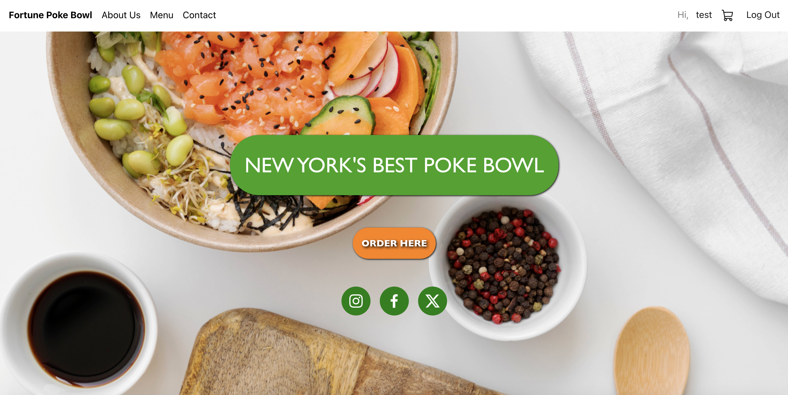
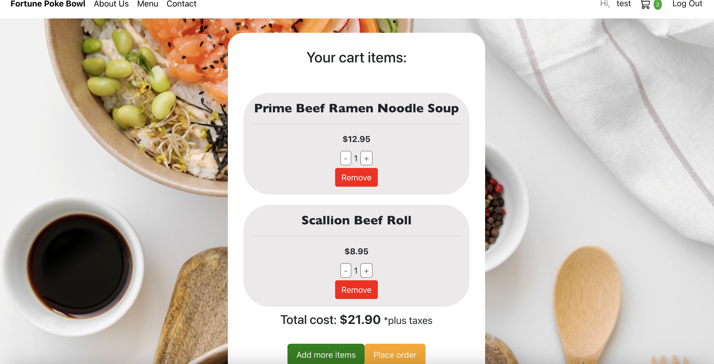
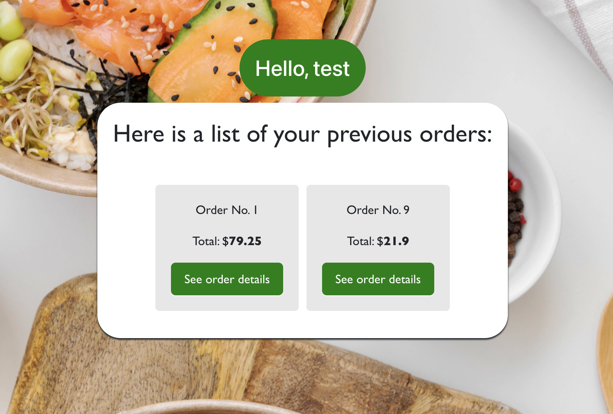
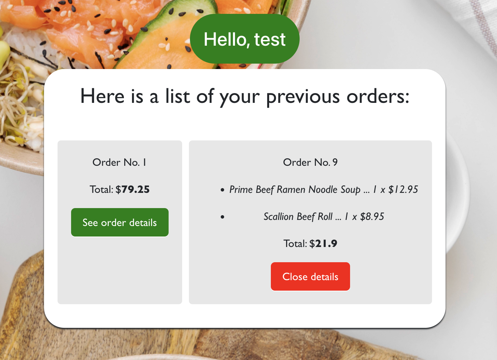

# Fortune Poke Bowl - Capstone Project

This is a SPA where the user can browse through the restaurant menu and place orders.

## Requirements to install and run this program 
- Access to a terminal. (due to environmental issues, unable to deploy project)
- Internet browser. 

# Aplication Instructions
- Navigate to the directory of your choosing in your terminal and `git copy` + repo from GitHub link. 
- Change directory again within ph5-capstone and open by running `code .`
- Open 2 terminals: 1st for ph5-capstone (Ruby server) and the 2nd terminal for the client (change directory by running `cd client`).
- For the backend server, run the command `bundle install` (to install ruby gems required) and then please run `rails s` (make sure you have Rails installed before running this)
- For the frontend side, in the client terminal, please run `npm install` (installing all dependencies) and then `npm start`.
- After running the `npm start` command the application should open automatically in your browser. If not, access it through this [link](http://localhost:4000).
- The image you should be greeted with is the following: 

- You are invited to create an account by signing up. (see below information for test/admin login info)
- After successfully creating an account, you will be receiving an email confirming the registration. 

## Login Info
*Testing*
Name: test
Password: test

*Admin* - full CRUD 
Name: admin
Password: 100

- After login, the home page will look like this: 

- The navigation bar contains multiple client routes: Fortune Poke Bowl (/home), About Us (/about), Menu (/menu), Contact (/contact), *username* (/user-profile) and *cart emoji* (/cart), and Log Out for logging out. 

## Functionalities 
- If using the admin login credentials, the user is able to perform full C.R.U.D on the menu items. 
- If a new user is created, the user is able to place orders by simply pressing the 'Add to cart' button. The user will be notified by a notification banner and the cart displaying the number of items inside the cart. If the user wishes to remove the item from the cart while inside the Menu page, the page will display a 'Remove from cart' button.
- To place order, simply click on the cart emoji where you will have the items displayed with the option to either remove from cart or add/subtract the number of items the user wishes to purchase. 

Example: 

- After successfully placing the order, the user will be notified by another banner that will say 'Order has been placed!'. The cart will be automatically emptied and the user will have the option to see 'Previous orders' where the order placed will be displayed. After pressing the 'See order details', the order cart will expand and display details such as total price, number of items and name of each item ordered. 

- The login session will end when the user clicks on 'Log Out'. 

Hope you enjoy this application!

## Technologies used:
- API: Ruby on Rails
- Database: SQLite3
- Client-side: React, Bootstrap HTML, CSS.

## Resources: 
- Pictures: [Freepik](freepik.com)
- Menu items, contact information, phone number: [Fortune Bowl](https://www.yelp.com/biz/fortune-bowl-new-york)
- Documentation: [DEV](dev.to), [Medium](medium.com), [Youtube](youtube.com)
- Flatiron School - SE course - curriculum and labs. 